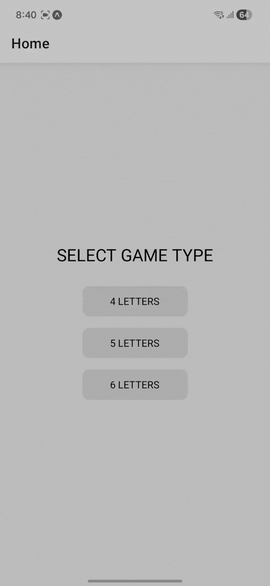
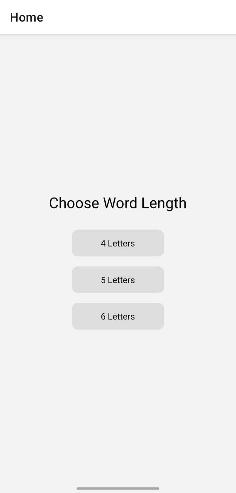
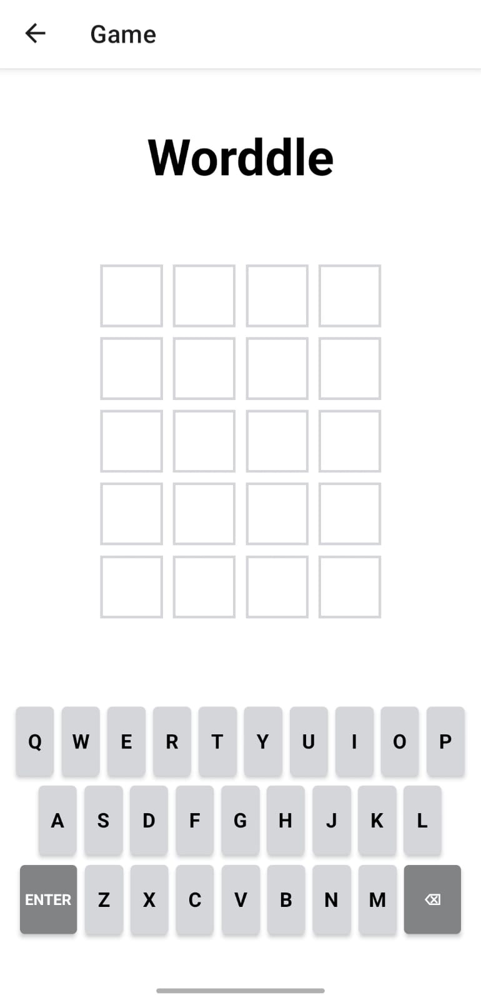
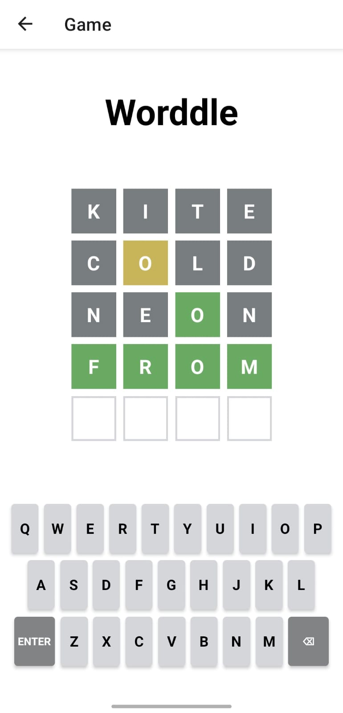

# Worddle

Worddle is a mobile game built with React Native and Expo. It turns a familiar word puzzle into a clean mobile experience with dynamic board generation, a custom on-screen keyboard, and instant color-coded feedback for every guess.

# Demo Walkthrough

<table width="100%">
  <tr height="120">
    <td width="30%" valign="top">
      <h2>Multiple puzzle modes</h2><br />
      Supports 4-letter, 5-letter, and 6-letter gameplay for a more flexible challenge.
    </td>
    <td width="40%" align="center" valign="top" rowspan="3">
      <br /><br />
      <h2>Worddle Demo Walkthrough</h2>
    </td>
    <td width="30%" valign="top">
      <h2>Custom keyboard controls</h2><br />
      Built with enter and delete actions for intuitive gameplay on mobile.
    </td>
  </tr>
  <tr height="120">
    <td valign="top">
      <h2>Responsive interface</h2><br />
      Designed for smooth mobile interaction with a clean and focused layout.
    </td>
    <td valign="top">
      <h2>Instant visual feedback</h2><br />
      Each guess is evaluated with color-coded tiles to guide the player.
    </td>
  </tr>
  <tr height="120">
    <td valign="top">
      <h2>Dynamic game board</h2><br />
      The grid adapts to the selected word length and updates in real time.
    </td>
    <td valign="top">
      <h2>Complete gameplay flow</h2><br />
      Includes both victory and loss states for a more polished user experience.
    </td>
  </tr>
</table>

## Screenshots

<table width="100%">
  <tr>
    <td align="center" width="33.33%">
      <br /><br />
      <b>Home Screen</b>
    </td>
    <td align="center" width="33.33%">
      <br /><br />
      <b>Game Board</b>
    </td>
    <td align="center" width="33.33%">
      <br /><br />
      <b>Color Coded Evaluation</b>
    </td>
  </tr>
</table>


## Highlights

- Built a mobile word game with support for 4-letter, 5-letter, and 6-letter puzzle modes
- Implemented dynamic guess-grid rendering and custom keyboard interactions for a responsive gameplay experience
- Added real-time per-letter feedback using color states to mirror familiar puzzle-solving mechanics
- Structured the app with reusable components and navigation-driven flow for maintainable frontend architecture

## Features

- Multiple word-length modes
- Dynamic board generation based on selected difficulty
- Randomized target word selection from local word lists
- Custom virtual keyboard with enter and delete controls
- Color-coded tile feedback for guess evaluation
- Clean flow between home screen and gameplay screen

## Tech Stack

- React Native
- Expo
- JavaScript
- React Navigation
- React Hooks

## How It Works

1. The user selects a word length from the home screen.
2. The app generates a game board based on the selected mode.
3. A random word is picked from the matching local word list.
4. The player enters guesses through the custom keyboard.
5. Each letter is evaluated and displayed with visual feedback.

## Project Structure

```text
worddle/
├── App.js
├── index.js
├── screens/
│   ├── HomeScreen.js
│   └── GameScreen.js
├── components/
│   ├── Grid.js
│   ├── Cell.js
│   └── Keyboard.js
├── utils/
│   └── Words.js
├── assets/
└── package.json
```

## Getting Started

```bash
npm install
npm start
```


